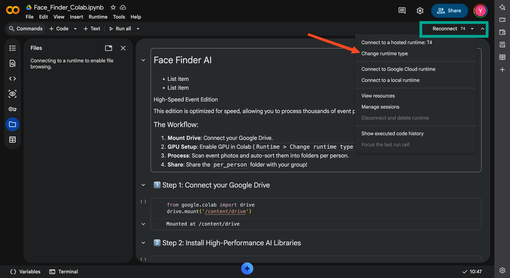
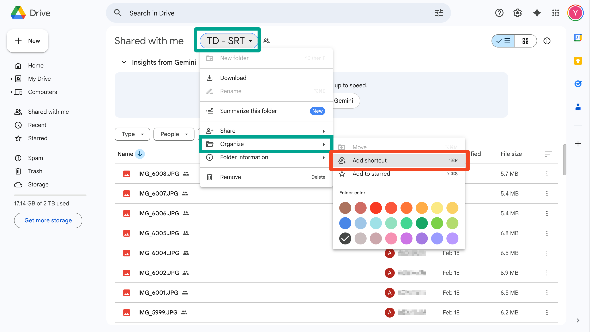
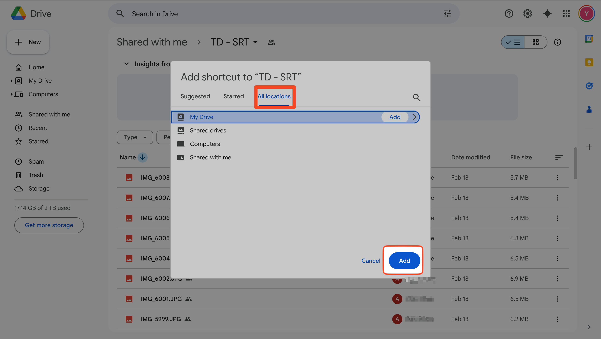

# ☁️ Using Face Finder on Google Colab

This guide explains how to use Face Finder in the cloud to process event photos stored on Google Drive.

##  Setup Steps

### 1. Upload the Notebook
- Download `Face_Finder_Colab.ipynb` from this repository.
- Go to [Google Colab](https://colab.research.google.com/).
- Click **File > Upload notebook** and select the file.

---

### 2. Enable GPU (Critical for Speed)
To process 1000s of photos in minutes, you must toggle the GPU:
1.  Click **Runtime** (in the top menu). 
2.  Click **Change runtime type**.
3.  Select **T4 GPU** from the dropdown. 
    > 🖱️ *Menu -> Runtime -> Change runtime type -> Hardware accelerator -> T4 GPU*
4.  Click **Save**.

---

### 3. Prepare your Folders
Ensure your Google Drive has the following structure:
- `Known/`: Reference photos.
- `Event_Photos/`: Photos to scan.

####  How to use a Shared Folder (Shared Link):
If the photos are in a shared link, you must add a shortcut to your own Drive:
1.  **Open the Shared Link** in your browser.
2.  **Right-Click** the folder name or click the 3 dots.
3.  Select **Organize** > **Add shortcut**.
    > 🖱️ *Right-click -> Organize -> Add shortcut -> My Drive*
4.  Choose **My Drive** as the destination.

3.  **Confirm**: Go to your [Google Drive](https://drive.google.com/) and verify the folder appears with a small "arrow" icon.
4.  **Colab Path**: In the notebook, your path will now be `/content/drive/MyDrive/YOUR_SHORTCUT_NAME`.

## 🏃‍♂️ Running the Tool

1.  **Mount Drive**: Run the first cell and authorize Google Drive access.
2.  **Install Libraries**: Run the setup cell. This will install the AI models and GPU drivers.
3.  **Set Paths**: Update the `KNOWN_FACES` and `EVENT_PHOTOS` variables in the config cell to match your Drive paths.
4.  **Process**: Run the final cell.

## ⚙️ Troubleshooting
- **No faces found**: Ensure your "Known" photos are clear and front-facing.
- **Too slow**: Verify that "Applied providers" in the logs shows `CUDAExecutionProvider`. If not, check "Enable GPU" instruction above.
- **Path not found**: Remember that Linux is case-sensitive (`data` is different from `Data`).
