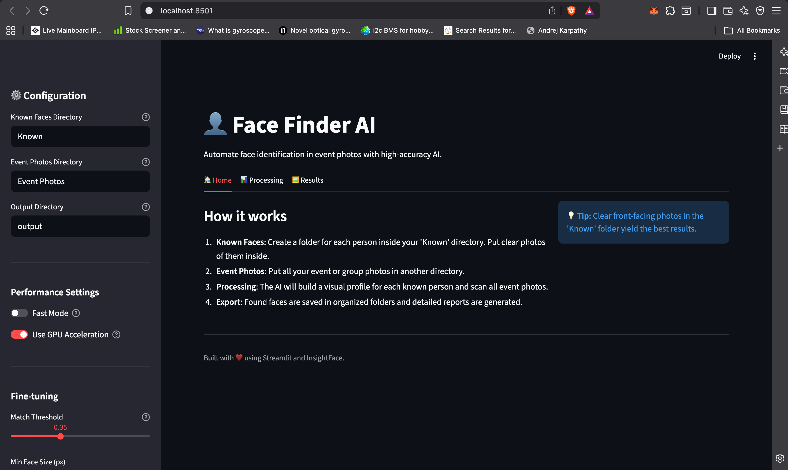

# 👤 Face Finder

Face Finder is a high-performance, AI-powered tool for identifying and matching faces in large collections of event photos against a set of known individuals. It is designed to automate the process of sorting photos for groups, trek teams, or event attendees.

## 🖼️ Supported Formats
- **Standard**: `.jpg`, `.jpeg`, `.png`, `.bmp`, `.webp`
- **iPhone**: `.heic`, `.heif`
- **DSLR/High-Res**: `.tiff`, `.tif`, `.dng`

---

## 🛠️ How to Select Paths (Local)
If you are running the UI locally and need to select a folder:
- **macOS**: Right-click the folder in Finder -> Hold **Option (⌥)** -> Select **"Copy [Folder] as Pathname"**.
- **Windows**: Right-click the folder in File Explorer -> Select **"Copy as path"**.
- **Paste** the copied path into the text boxes in the Streamlit UI.

---



## ☁️ Running in Google Colab (Recommended)
The fastest way to use Face Finder without installing anything on your computer.

1.  **Open the Notebook**: Upload `Face_Finder_Colab.ipynb` to [Google Colab](https://colab.research.google.com/).
2.  **Enable GPU**: Go to `Runtime > Change runtime type` and select **T4 GPU**.
3.  **Mount Drive**: Run the first cell to connect your Google Drive.
    - *Tip: If the photos are in a shared link, click "Add shortcut to Drive" in your browser first.*
4.  **Configure & Run**: Update your folder paths and hit "Run All".

### 📂 How to Share with a Group:
Once the processing is finished:
1.  Open your Google Drive and find the `Output/per_person/` folder.
2.  **Right-click > Share** this folder with your group via a "Anyone with link" access.
3.  Each person can enter the folder named after them and download only their own photos!

---

## 💻 Local Installation

### Prerequisites
- Python 3.8+
- (Optional) NVIDIA GPU with CUDA for acceleration.

### Setup
```bash
git clone https://github.com/0xYuvi/Face-Finder.git
cd Face-Finder
pip install -r requirements.txt
```

### Usage (Web UI)
```bash
streamlit run app.py
```

### Usage (CLI)
```bash
python face_finder1.py --known "./Known" --photos "./Events" --output "./Results" --use-gpu
```

---

## 🛠️ Configuration
- `--known`: Directory containing reference faces (folders or direct images).
- `--photos`: Directory containing event photos to scan.
- `--output`: Directory to save annotated images and sorted folders.
- `--threshold`: Similarity threshold (default: 0.35). Lower for more matches, higher for accuracy.
- `--det-size`: Detection resolution (320 for speed, 640 for accuracy).
- `--use-gpu`: Enable GPU acceleration.

## ⚖️ License
Distributed under the **MIT License**. See `LICENSE` for more information.

## 🤝 Contributing
Contributions are welcome! Please see `CONTRIBUTING.md` for guidelines.
